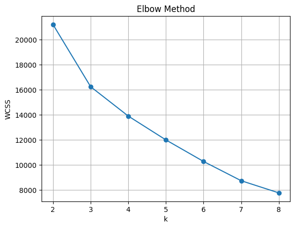
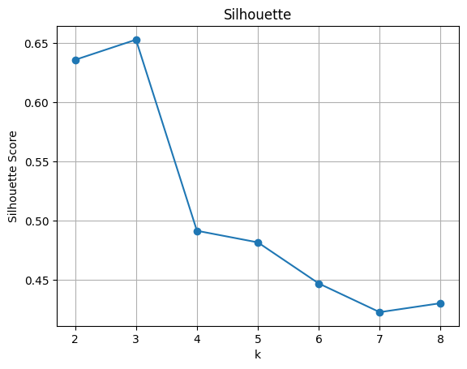
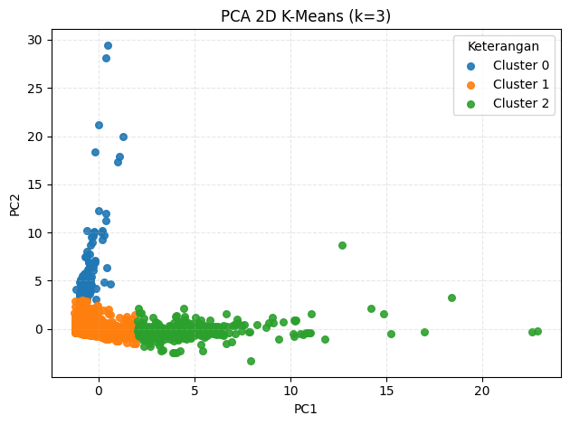
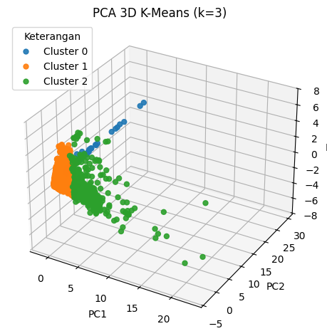

# Restaurant Tax Potential Segmentation — K-Means Clustering

Local governments that manage restaurant tax revenue often struggle to prioritize which taxpayers to monitor and support. With thousands of registered restaurants and no systematic way to group them by scale or activity, tax officers had to rely on manual, case-by-case judgment to identify high-potential taxpayers — a process that is slow and prone to inconsistency.

This project applies **K-Means clustering** to segment restaurants by their operational characteristics — seating capacity, average bill per customer, daily turnover, visitor counts, and monthly revenue — into groups with low, medium, and high tax potential. The optimal number of clusters was determined using the **Elbow Method** and **Silhouette Score**, and the resulting segments were visualized with **PCA** (2D and 3D) to validate cluster separation. All data was anonymized (taxpayer ID, name, and address removed) before analysis.

The clustering identified **3 well-separated segments** (Silhouette Score peaking at k=3): a small-scale but high-transaction-frequency segment, a stable mid-size segment, and a high-revenue segment responsible for the largest share of tax potential. This segmentation gives the tax authority a data-driven basis for prioritizing monitoring, guidance, and enforcement — replacing manual triage with a repeatable, defensible method.

This project was completed during a **Practical Work (Kerja Praktik)** placement at Badan Pendapatan Daerah (BAPENDA) Kota Surabaya, Department of Mathematics, Institut Teknologi Sepuluh Nopember.

**Author:** Raissa Undita Estiningtyas
**Advisor:** Dr. Dieky Adzkiya, S.Si, M.Si

> **Note on data:** The original dataset belongs to a government tax authority and is not included in this repository. `src/preprocessing.py` and `src/modeling.py` reproduce the exact pipeline used; point them at your own data with the same column structure to run them.

## Methodology

1. **Data collection** — restaurant operational data (seating, turnover, visitors, revenue) from BAPENDA's internal system.
2. **Preprocessing** — identity anonymization, cleaning (duplicates, missing values, data types), feature selection, Z-score standardization.
3. **Determining optimal k** — Elbow Method (WCSS) and Silhouette Score, both converging on k = 3.
4. **K-Means clustering** — grouping restaurants into 3 segments based on standardized features.
5. **Evaluation** — inertia and silhouette score to confirm cluster quality and stability.
6. **Visualization** — PCA (2D/3D) to inspect cluster separation, plus per-cluster feature averages to profile each segment.

## Results

**Choosing the optimal number of clusters.** Both the Elbow Method and the Silhouette Score point to k = 3: WCSS stops dropping sharply past k = 3, and the Silhouette Score peaks at k = 3 (≈0.65) before declining for larger k.

<p align="center">   </p>
<p align="center"> <em>Elbow Method (left) and Silhouette Score (right) across k = 2–8, both indicating k = 3 as optimal.</em> </p>

**Cluster separation.** Reducing the standardized features to 2 and 3 principal components with PCA confirms that the three clusters are well separated, with Cluster 1 (medium potential) as the dense core, Cluster 0 (low potential, high-frequency small outlets) spread along one axis, and Cluster 2 (high potential) forming a distinct, more dispersed group.

<p align="center">   </p>
<p align="center"> <em>PCA 2D (left) and PCA 3D (right) projections of the 3 clusters.</em> </p>

## Repository Contents

```
restaurant-tax-segmentation-kmeans/
├── README.md
├── src/
│   ├── preprocessing.py   -- cleaning, imputation, standardization
│   └── modeling.py        -- optimal k selection, K-Means, PCA visualization
└── results/
    ├── elbow_kmeans.png
    ├── silhouette_kmeans.png
    ├── pca2d_kmeans.png
    └── pca3d_kmeans.png
```

## Cluster Profiles

| Segment | Characteristics | Tax Potential |
|---------|------------------|----------------|
| Cluster 0 | Small physical scale, near-zero seating, but very high transaction turnover (e.g. fast-food / take-away model) | Low |
| Cluster 1 | Mid-size capacity, stable daily/weekend turnover, moderate revenue | Medium |
| Cluster 2 | Large seating capacity, hundreds of visitors per day, highest monthly revenue | High |

## How to Run

1. Point `EXCEL_PATH` in `src/preprocessing.py` to your dataset (same column structure as described in the script) and run it.
2. Run `src/modeling.py` to select the optimal number of clusters, fit K-Means, and generate the visualizations in `results/`.
